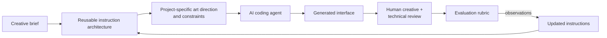

# Designing More Reliable AI-Generated React Interfaces

A creative-technology case study in designing, testing and iterating the **workflow around** AI-assisted interface generation, turning design intent into reusable instructions for more consistent, controllable and review-ready React + TypeScript output.

> **At a glance**
> - **Challenge:** AI generates UI fast, but each generation invents its own styling, data patterns and accessibility choices. Components tend to become islands that someone has to reconcile by hand.
> - **Hypothesis:** a structured instruction architecture makes AI-generated UI more consistent and closer to review-ready than an unguided baseline given the same brief.
> - **What I designed:** a layered system of shared rules, design tokens, generation modes that make room for art direction, and anti-pattern guardrails, with human review feeding changes back into the instructions.
> - **How I tested it:** the same brief, editor and one-shot budget in a clean baseline project and in a guided one. Two scenarios, one run each.
> - **What I observed (v1.0):** the guided output reused a shared token system and a layered structure without being asked; the baseline hardcoded values and rebuilt theming per component.
> - **Evidence boundary:** documented results relate to **v1.0**. The Color Setup Flow was introduced in **v1.1** after the evaluation and hasn't yet been tested under the same conditions. The evidence so far is a written code review; screenshots and source are pending.
> - **What this is not:** a claim to outperform or replace general-purpose frontend skills. It's a case study about the workflow layer *around* generation, and it can sit alongside such skills.

*A structured showcase evaluation, not a statistically generalisable benchmark.*

---

## The challenge

AI coding agents can produce a working interface in minutes. The trouble starts at the second, fifth and twentieth component. Without shared direction, each generation makes its own decisions about colour, spacing, file structure, data fetching, theming and accessibility. Every output can be competent and still be inconsistent with the last.

That's a **workflow quality problem**, not a claim that AI output is bad. The cost shows up in review, in reconciling styles, and in cleanup before a designer or engineer can sign anything off.

## What I designed

Generation is one step in a loop, not the end of the process:

- **Principles are strict, values are flexible.** Rules describe *how* to build; design tokens hold *what it looks like*. Changing direction is one edit, not a refactor.
- **Consistency must not become visual sameness.** Three generation modes (Template, Balanced, Design-First) decide how far a provided design overrides the defaults.
- **Guardrails surface problems for humans.** Anti-pattern rules are treated as hard constraints (v1.0). After the tests, a read-only self-audit was added so the agent reports problems before fixing them. *(Not yet tested.)*
- **Creative input is asked for, not assumed.** The v1.1 Color Setup Flow asks for a palette, seed colours or a mood, checks contrast, and waits for approval. *(Not yet tested.)*

→ Full design in [`instructions/architecture.md`](./instructions/architecture.md).

## What I tested

Two scenarios, a **UserProfileCard** (variants, data, UI states) and a **NotificationCenter** (polling, focus management, responsive behaviour), each run once in a clean baseline project and once with instruction **v1.0**. Same brief, same editor (Cursor), same model setting, one prompt, no follow-ups.

→ Briefs, conditions and threats to validity in [`comparison.md`](./comparison.md).

## Observed differences (v1.0)

| Area | Baseline tendency | Guided tendency (v1.0) |
|---|---|---|
| Design-system alignment | Hardcoded hex/px; component-local variables | Global tokens throughout |
| Theming | Dark mode rebuilt in each component | Inherited from the token layer |
| Component composition | Fetching, state and UI co-located | Schema → API → hook → component |
| Data and error handling | Type cast, no retry | Runtime validation, retry action |
| Accessibility fundamentals | Solid basics | Basics plus focus return, dialog semantics and 44px targets |
| Visual consistency | *Evidence pending* | *Evidence pending* |
| Manual cleanup before review | *Not measured* | *Not measured* |

Some of the guided choices were specified by the instructions, so part of this table shows **consistency and instruction-following**, not independent judgement. [`comparison.md`](./comparison.md) separates the two.

**Next evaluation:** rerun the same scenarios with v1.1 to assess whether the Color Setup Flow increases art-direction flexibility without reducing structural consistency. → [Evidence roadmap](./examples/README.md#evidence-roadmap)

## Beyond a general-purpose frontend skill

General-purpose frontend skills, such as Anthropic's published `frontend-design` skill, help an AI agent make more intentional visual decisions and avoid generic defaults. This project focuses on a **complementary layer**: how creative and technical teams can structure, test and evaluate AI-assisted UI generation as a repeatable workflow, connecting briefs, reusable constraints, art direction, structured comparison, human review and iteration.

A frontend skill can be one input inside this workflow. That combination hasn't been tested yet, and nothing here compares this project's performance against any skill.

| Dimension | General-purpose frontend skill | This project's focus |
|---|---|---|
| Primary purpose | Guides the agent's design approach during an individual frontend task | Makes AI-assisted UI production more controllable, reviewable and improvable across components |
| Visual direction | Primary focus: intentional aesthetic choices grounded in the brief, avoiding templated defaults | Connects visual direction to generation modes that decide which values stay fixed and which remain open |
| Reusable UI-system constraints | Typically proposes a token plan per brief | A persistent, shared token layer and component rules reused by every generation in a project |
| Loading, empty and error states | Guidance depends on the skill; the published `frontend-design` skill covers how to write for them | Part of the generation rules and the review criteria |
| Baseline vs. guided comparison | Outside a skill's scope | Central method of this case study |
| Failure modes and iteration | In-task self-critique | Versioned changes to the instructions themselves, documented between tests |
| Human review | Supports the agent's own plan review | Human creative and technical review in the loop; approval and audit steps added after the v1.0 tests (untested) |
| Tool scope | Packaged as an Agent Skill | Principles written in tool-neutral form; tested in Cursor only |

## Iterations and learning

- **v1.0** was tested (results published 2026-02-09).
- **After the tests (13 Feb):** a build order and a read-only self-audit protocol were made explicit, and **v1.1** added the Color Setup Flow to separate creative input from structural rules.
- **Open learning:** none of the post-test changes has been re-evaluated yet. Until they are, they're design intentions, not results.

→ Observation / Change / Why / Outcome for each step, plus known trade-offs, in [`docs/iterations.md`](./docs/iterations.md).

## Limitations

Instructions are designed to raise the quality floor; they don't replace creative direction, engineering review or accessibility validation. The evaluation is two single runs with an unpinned model setting, reviewed by the author, and model behaviour changes over time. Some implementation details are intentionally omitted to preserve the project's commercial and competitive value. → [Threats to validity](./comparison.md#threats-to-validity)

## What's public, and what's omitted

The core instruction file ([`.cursorrules`](./.cursorrules); current v1.1, which includes the untested post-evaluation changes), the architecture, test briefs, method and observations are public. The domain guides (including the full anti-pattern rule set), the production token file and the template repository are private. A walkthrough is available on request via [LinkedIn](https://www.linkedin.com/in/niklazhallberg/).

## Repository map

| Path | What it is |
|---|---|
| [`comparison.md`](./comparison.md) | Method, briefs, v1.0 observations, threats to validity |
| [`instructions/architecture.md`](./instructions/architecture.md) | Tool-neutral design of the instruction architecture |
| [`examples/`](./examples/) | Scenarios, rubric, evidence protocol and evidence roadmap |
| [`docs/iterations.md`](./docs/iterations.md) | What changed between versions, why, and what is untested |
| [`.cursorrules`](./.cursorrules) | Representative Cursor-format instruction artifact (v1.1) |
| [`CHANGELOG.md`](./CHANGELOG.md) | Version history of the architecture and this case study |

## Author

Niklaz Hallberg is a Creative Technologist working across generative AI, creative tools, interactive media and AI-assisted production workflows. This repository is a public case study in making generative frontend workflows more controllable, inspectable and useful in real creative production.

[niklaz.works](https://www.niklaz.works) · [LinkedIn](https://www.linkedin.com/in/niklazhallberg/)
